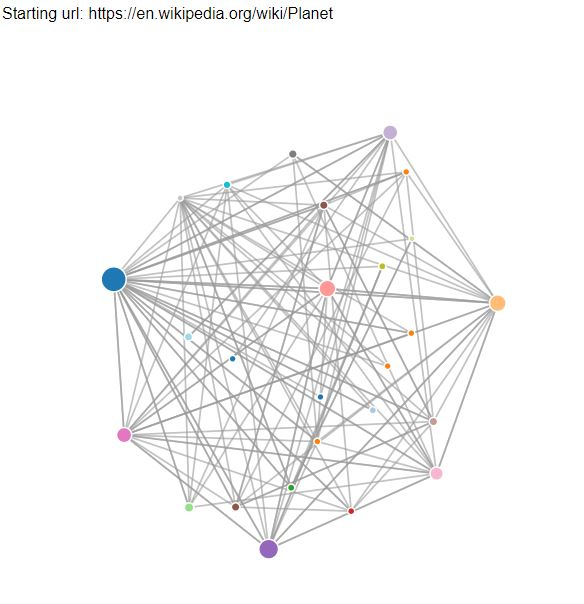

### Simple Python Search Spider, Page Ranker, and Visualiser

This is a set of programs that emulate some of the functions of a search engine. 
In this run, we told it to crawl a website and retrieve 100 pages. 

`Enter web url or enter: https://en.wikipedia.org/wiki/Planet
['https://en.wikipedia.org/wiki/Planet']
How many pages:100
1 https://en.wikipedia.org/wiki/Planet (556659) 527
17 https://en.wikipedia.org/wiki/Planet_Nine (535739) 642
......
How many pages:
`

It is possible to have multiple starting points in the same database. The spider chooses randomly amongst all non-visited links across all the webs. 

Once there are a few pages in the database, Page Rank can be run on the pages by iterating up to 25. 

`How many interations: 25
.....
22 0.016402914646448486
23 0.016180941180045927
24 0.015954157683358033
25 0.015738799621845215
[(1, 5.777114978878193), (17, 0.6026623205167162), (3, 0.4287580825283178), (5, 0.33611857377910226), (16, 3.1456498471378045)]`

To dump the contents, we run the number of incoming links, the old page rank, the new page rank, the id of the page, and the url of the page. The program only shows pages that have at least one incoming link to them.

`(55, 1.0, 0.4692065358779471, 89, 'https://en.wikipedia.org/wiki/Planet_of_the_Apes_(comic_book)')
(51, 1.0, 3.979378101287807, 65, 'https://en.wikipedia.org/wiki/Planet_of_the_Apes:_Last_Frontier')
(45, 1.0, 0.23387903442113359, 57, 'https://en.wikipedia.org/wiki/Planetary_Society')
100 rows.`

For each iteration of the page rank algorithm it prints the average change per page of the page rank. the network initially is quite unbalance and so the individual page ranks are changing wildly. But in a few short iterations, the page rank converges.

Here shows the output of this program:

